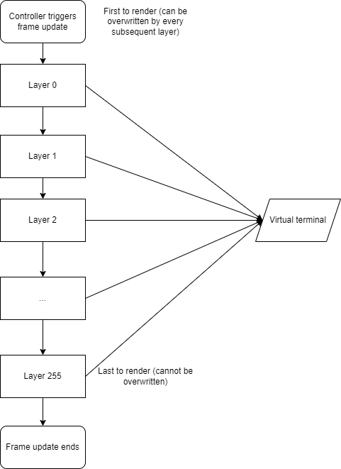

# Tooey -- the no-std barebones TUI library

Made for use with [SprinklesOS](https://github.com/T-O-R-U-S/sprinkles_os); Tooey is (for the moment) monochromatic.

## What is Tooey?

Tooey is a no-std TUI library written for my personal use in Sprinkles OS!

It's currently monochromatic, but that can change :) (adding colour is a todo, since Sprinkles itself supports
colour display (thank you VGA text mode :))

The terminal must be of constant size

## Why is Tooey?

I couldn't find any no-std TUI libraries, and that made me sad :(

Fortunately, I am now finding my own happiness (by writing Tooey) :)

## The Tooey architecture

Every "widget" in Tooey is an object -- objects cannot communicate with each other, but they can receive updates from a central controller.

Though SprinklesOS does support Rust's collections, Tooey works exclusively with fixed-size arrays. As such, there is an object
limit of 256 objects per virtual terminal instance... however, you can bypass this by nesting objects within objects.

Rendering in Tooey works like layers.



Each layer contains one object; that object can either be an empty object (doing nothing), or it can be
an object like a prompt that displays text in the middle of the screen.

The virtual terminal will never redraw itself unless it's updated or expressly redrawn. Objects cannot
draw themselves on initialization until a redraw occurs, so after initialization it is recommended
to draw your objects (if you like seeing them :).

The virtual terminal itself does not handle displaying its contents; it's only a store of characters on the screen -- displaying these characters should be handled by the library user; this makes
the library much more flexible than other alternatives since it doesn't necessarily require terminals to
follow any specific standard for them to function so long as the terminal supports the minimum required
features.

## Objects

Objects are similar to widgets; they can contain data to help them contain state (i.e, a string inside of a
text widget, or a number inside a counter).

There is one of these in every layer, and their on_draw and on_update method gets called every time the
screen is either drawn or an update is sent.

### TerminalObject structure

#### `on_update`

The `on_update` function gets called every time the controller calls `.update()` on the terminal.

This method passes an `TerminalUpdate` enum to the object's `on_update` method to inform it of
the event.

The `on_update` method itself takes three arguments; the virtual terminal's characters, the object's data, and the update payload.

The `on_update` event then returns a `LifecycleEvent` to dictate what will happen to the object next.

```rs
/// Here's an example of what an on_update could look like!
fn prompt_on_update(
        _screen: &mut [[CHARACTER; WIDTH]; HEIGHT],
        // If you want to access the data, you will have to downcast it.
        _data: &dyn Any,
        update_payload: &TerminalUpdate,
    ) -> LifecycleEvent {
        // Only die if the event was a keypress or mouseclick.
        match update_payload {
            TerminalUpdate::KeyboardEvent(_) | TerminalUpdate::MouseClick(_, _) => LifecycleEvent::Death,
            _ => LifecycleEvent::NoEvent
        }
    }
```